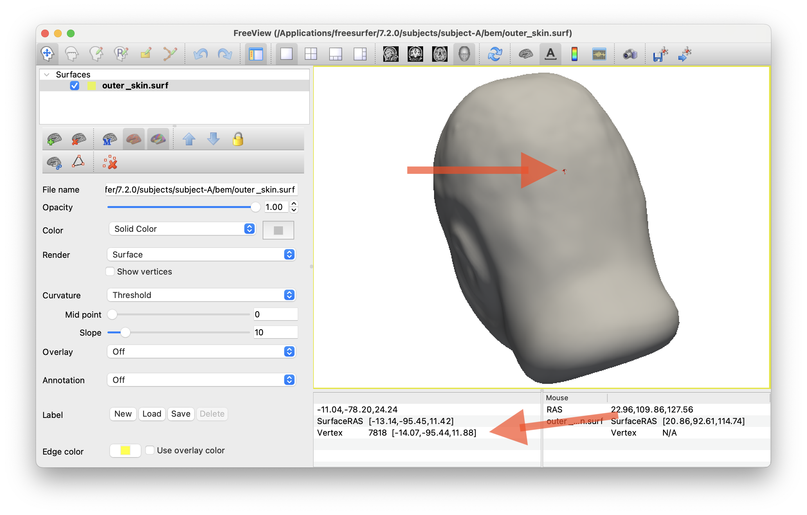
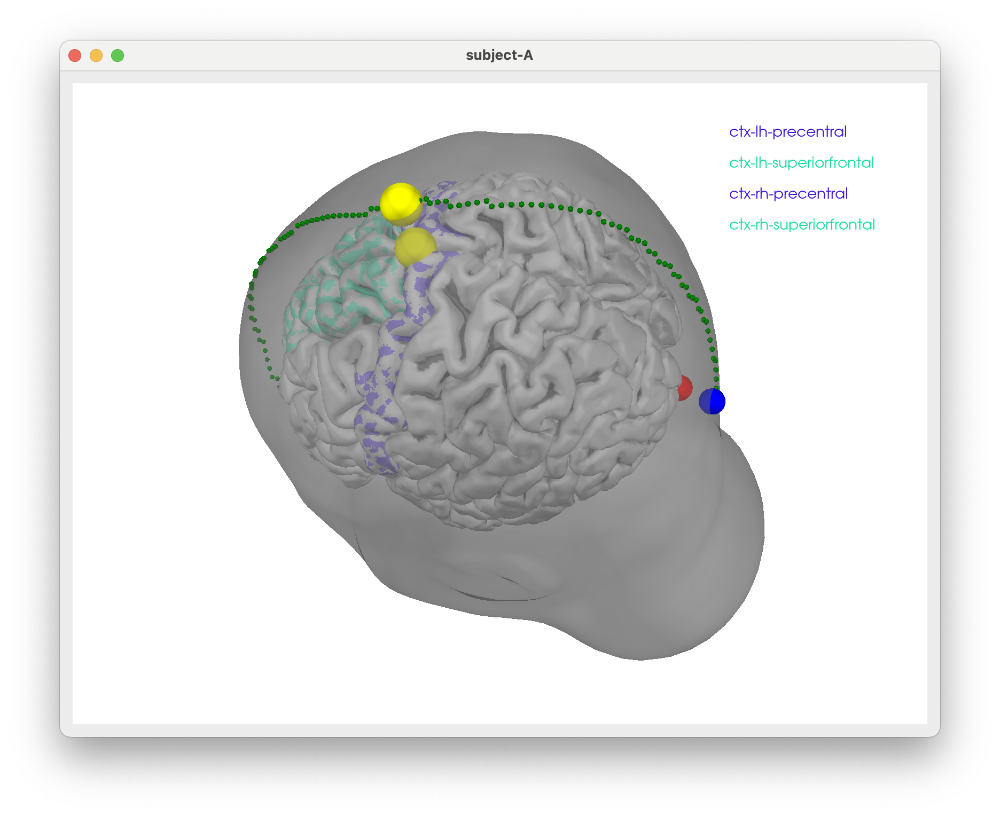
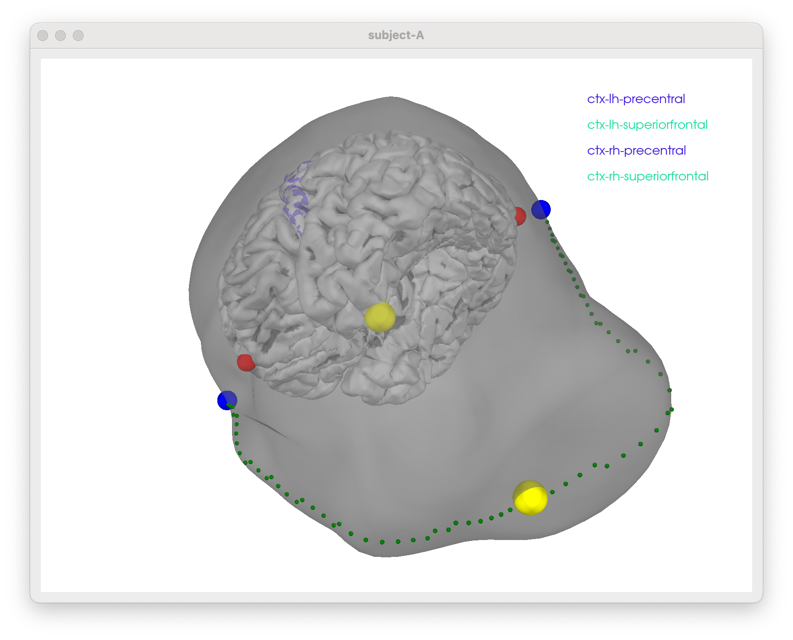

# Some freesurfer magic and `MNE` viz

Some notes to figure out how to show TMS stim sites scalp/skull surfaces w/ promixity to particular regions in the brain

<center>

</center>

## General ideas

- use `freesurfer` to generate scalp/skull surfaces from T1 MRI
- use `mne` tools to generate BEM surfaces from freesurfer outputs
- use `mne` to visualize TMS coil positions relative to scalp/skull/brain surfaces and/or `matlab` with specific freesurfer visualization tools

1. Assuming you have run freesurfer's `recon-all` on your T1 MRI to generate the necessary surfaces and have installed `mne` tools on your machine + have `matlab` knocking around 😄!

2. Use `mne watershed_bem` to generate scalp and skull surfaces

```bash
SUBNAME=subject-A
mne watershed_bem -s ${SUBNAME}
```

and visualise:

```bash
SUBNAME=subject-A
mne freeview_bem_surfaces -s ${SUBNAME}
```

This will allow you to get some nice screengrabs of skull / skin surfaces. Etc.

I also used this to approximate the inion/nasion points on the scalp surface for Cz locating. See code to check if that makes sense

<center>


</center>

## Visualizing TMS coil positions w/ CZ etc.

Probably easiest to do this in `python` using `mne.viz`. Here's some example code to get you started h/t prompts from Claude in Visual Studio Code and the documentation on the MNE site.

1. Make sure the right python environment is activated with `mne` installed

```bash
# if you used the MNE installer, something like:
conda activate /Applications/MNE-Python/1.11.0_0/.mne-python
```

You should be able to run the interative viz code below and see the scalp/skull surfaces along with fiducials and Cz of montage, if I got that correct.
[Inspect code at](./create_montage_viz.py) to see details.

```bash
# make sure right python!
conda activate /Applications/MNE-Python/1.11.0_0/.mne-python

# then run
python ./create_montage_viz.py
```


Etc. etc...


## Penalty for particular paths

- code includes a penalty for paths that deviate from sagittal plane `x_dev` is penalized.
- to avoid the shorted path hugging the surface inferiorly (when skull/scalp surfaces are relatively clipped inferiorly), a penalty for low z values (when `z_pos` is negative) is included.

```bash
# default behaviour PREFER upwards paths
python create_montage_viz.py    # default behaviour
python create_montage_viz.py up # default behaviour

# as a reality check you can also try to penalise upwards paths by PREFERing downwards paths
python create_montage_viz.py down
```

<figure>
<center>


</center>
<caption>Paths generated with preference for up (left) or down (right) directions</caption>
</figure>
